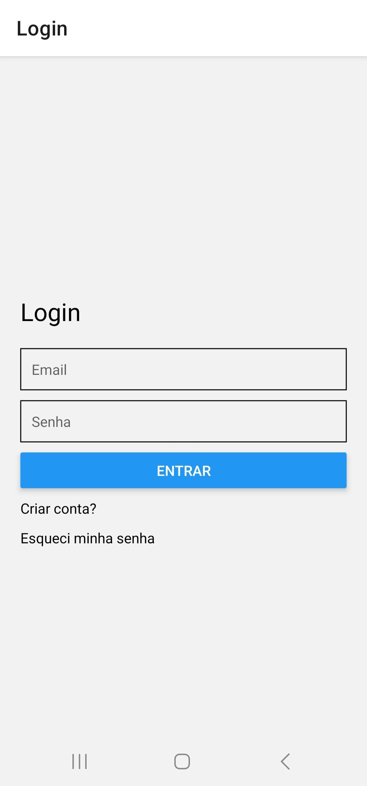
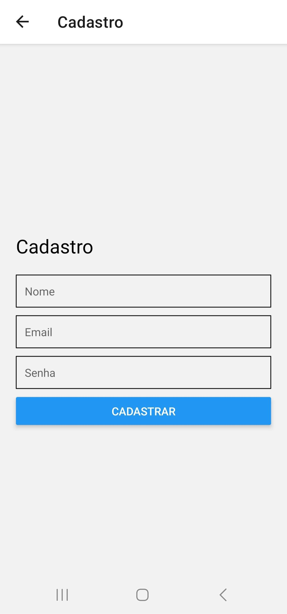
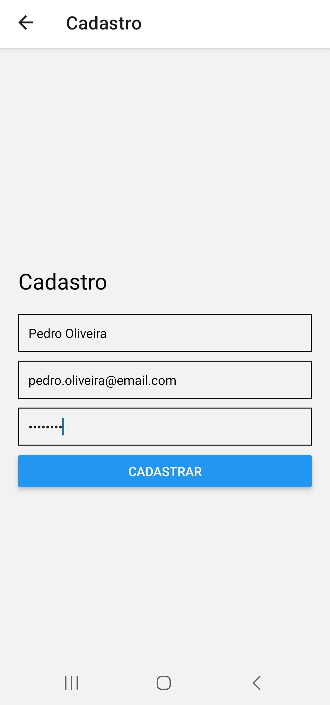
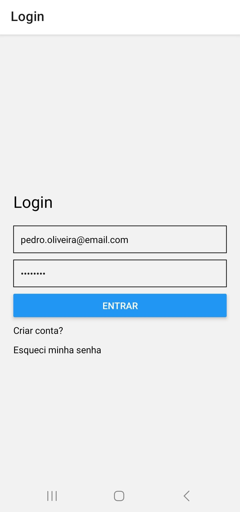
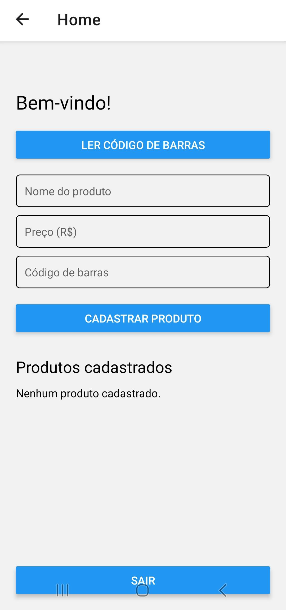
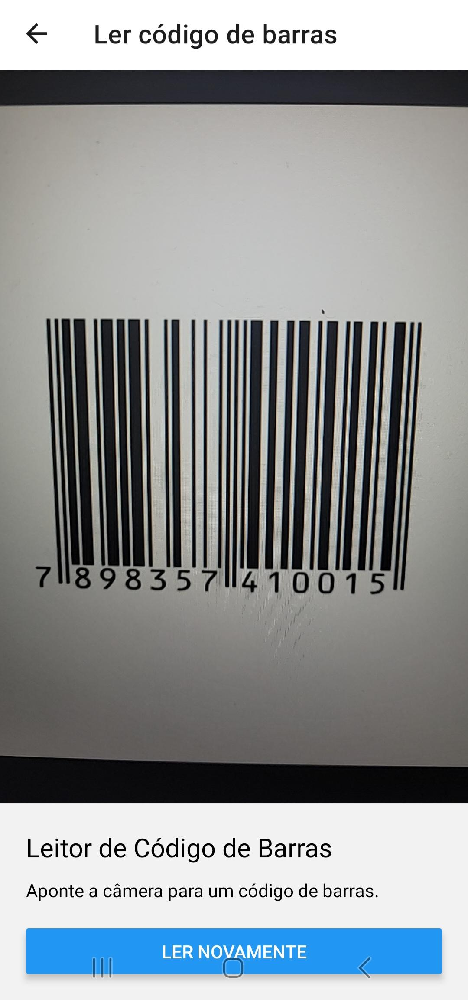
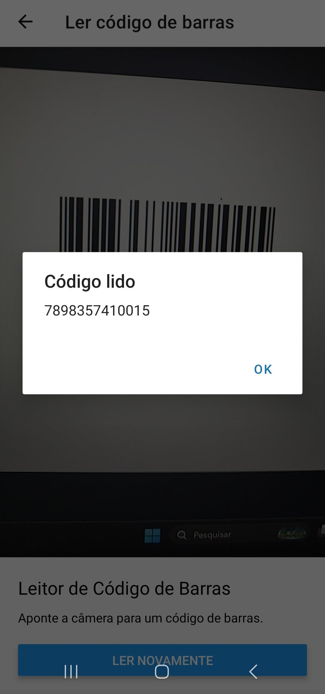
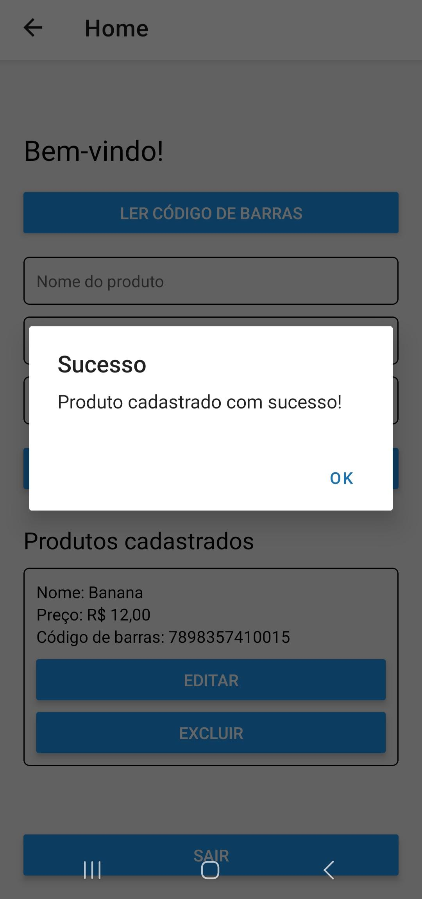
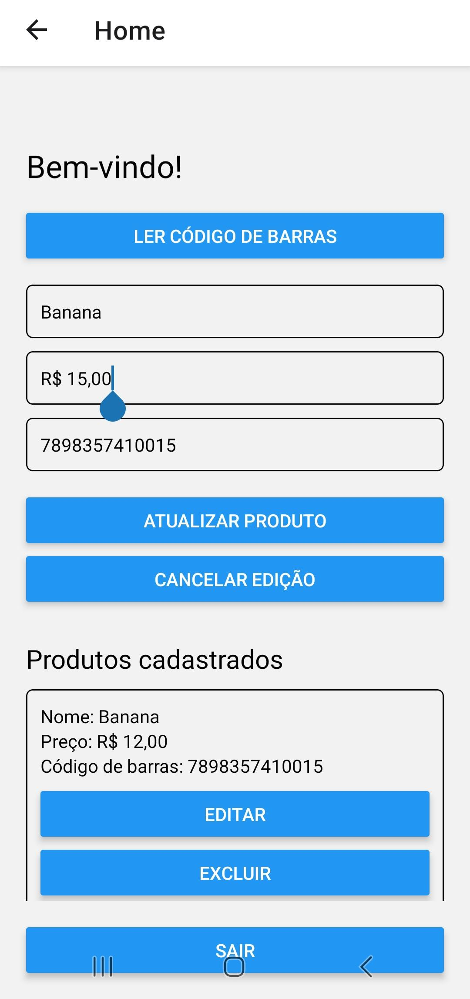
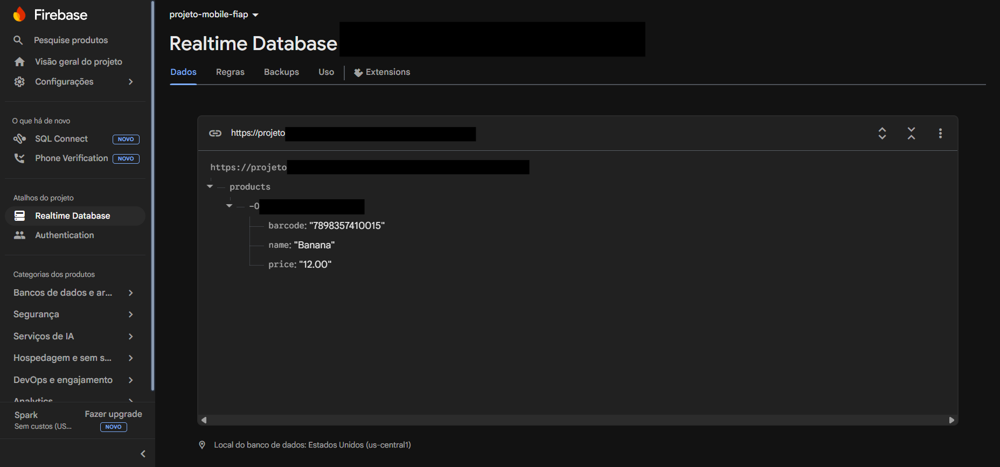

# 📱 FIAP_Mobile_Auth_CRUD

Aplicação mobile desenvolvida com **React Native + Expo** durante as aulas de **Mobile Development** da FIAP, cobrindo layout, navegação, autenticação com Firebase, CRUD completo com Realtime Database e leitura de código de barras.

---

## 📸 Screenshots

---

### 🔐 Autenticação — Cadastro e Login

Fluxo completo de criação de conta e acesso ao app via Firebase Authentication.

<div align="center">
  
  
  
  
  
</div>

> Da esquerda para direita: tela de login · tela de cadastro · preenchimento dos dados · confirmação de cadastro · login com as credenciais criadas.

---

### 🏠 Home & 📷 Leitor de Código de Barras

Acesso à tela principal e uso da câmera para leitura e preenchimento automático do código de barras.

<div align="center">
  
  
  
  
</div>

> Da esquerda para direita: home sem produtos · câmera apontada para código de barras · alert com o código lido · campo de código de barras preenchido automaticamente na Home.

---

### 🛒 CRUD de Produtos

Cadastro, listagem, edição e exclusão de produtos no Firebase Realtime Database.

<div align="center">
  
  
  
  
  
</div>

> Da esquerda para direita: confirmação de cadastro · produto listado · edição do preço · confirmação de atualização · diálogo de confirmação de exclusão.

---

### ☁️ Firebase Console

Dados reais registrados no Firebase após o uso do app — usuários autenticados e produtos salvos no banco.

<div align="center">
  
</div>

<p align="center"><em>Firebase Authentication — 6 usuários cadastrados via app.</em></p>

<div align="center">
  
</div>

<p align="center"><em>Firebase Realtime Database — produto salvo com nome, preço e código de barras.</em></p>

---

## 🚀 Tecnologias utilizadas

- [React Native](https://reactnative.dev/)
- [Expo](https://expo.dev/)
- [React Navigation](https://reactnavigation.org/) — navegação entre telas
- [Firebase Authentication](https://firebase.google.com/products/auth) — autenticação por email/senha
- [Firebase Realtime Database](https://firebase.google.com/products/realtime-database) — CRUD de produtos
- [Expo Camera](https://docs.expo.dev/versions/latest/sdk/camera/) — leitura de código de barras

---

## 📂 Estrutura do projeto

```
fiap-auth-app/
├── App.js
├── .env                  # Credenciais Firebase (não vai ao GitHub)
├── .env.example          # Modelo das variáveis de ambiente
└── src/
    ├── firebase/
    │   ├── config.js         # Inicialização do Firebase
    │   ├── authService.js    # Funções de autenticação
    │   └── productService.js # Funções de CRUD de produtos
    ├── navigation/
    │   └── AppNavigator.js   # Configuração das rotas
    └── screens/
        ├── LoginScreen.js
        ├── RegisterScreen.js
        ├── ForgotPasswordScreen.js
        ├── HomeScreen.js
        └── BarcodeScannerScreen.js
```

---

## 🗂️ Aulas

### Aula 01 — Layout e Navegação

Foco na criação do projeto e organização das telas sem backend.

**O que foi feito:**
- Criação do projeto com `create-expo-app`
- Instalação e configuração do React Navigation
- Estrutura de pastas `src/navigation` e `src/screens`
- Tela de **Login** com campos de email e senha
- Tela de **Cadastro** com campos de nome, email e senha
- Tela de **Esqueci minha senha** com campo de email
- Tela **Home** com mensagem de boas-vindas
- Navegação completa entre todas as telas

---

### Aula 02 — Firebase Authentication

Foco na integração com Firebase para autenticação real de usuários.

**O que foi feito:**
- Criação do projeto no Firebase Console
- Ativação do método de login **Email/Senha**
- Instalação do Firebase JS SDK (`npm install firebase`)
- Configuração com variáveis de ambiente (`.env`) para proteger as credenciais
- Criação do `authService.js` com as funções:
  - `registerUser` — cadastro de usuário
  - `loginUser` — login com email e senha
  - `resetUserPassword` — envio de email de redefinição de senha
- Integração nas telas:
  - `RegisterScreen` — cadastro real no Firebase
  - `LoginScreen` — autenticação real no Firebase
  - `ForgotPasswordScreen` — envio de email de recuperação

---

### Aula 03 — CRUD com Realtime Database

Foco na criação, listagem, edição e exclusão de produtos no Firebase Realtime Database.

**O que foi feito:**
- Criação do Realtime Database no Firebase Console
- Atualização do `config.js` para incluir o `getDatabase`
- Criação do `productService.js` com as funções:
  - `createProduct` — salva produto no banco
  - `getProducts` — lista todos os produtos
  - `deleteProduct` — remove produto pelo ID
  - `updateProduct` — atualiza dados de um produto
- Atualização da `HomeScreen` com:
  - Formulário de cadastro de produto (nome e preço)
  - Listagem com `FlatList`
  - Botão de **Excluir** com confirmação
  - Botão de **Editar** que preenche os campos para atualização
  - Botão de **Cancelar edição**
  - Limpeza automática do formulário após cada ação

---

### Aula 04 — Leitor de Código de Barras

Foco na integração da câmera do dispositivo para leitura de código de barras e vinculação ao cadastro de produtos.

**O que foi feito:**
- Instalação do `expo-camera` compatível com Expo SDK 54
- Criação da tela `BarcodeScannerScreen` com:
  - Solicitação de permissão da câmera
  - Abertura da câmera com `CameraView`
  - Leitura de código de barras via `onBarcodeScanned`
  - Prevenção de leituras múltiplas em sequência
  - Alert com o código lido e retorno automático para a Home
- Registro da nova tela no `AppNavigator`
- Atualização da `HomeScreen` com:
  - Botão **"Ler código de barras"** no topo
  - Campo de código de barras no formulário
  - Preenchimento automático do campo ao voltar do scanner via `route.params`
  - Salvamento do campo `barcode` junto ao produto no Firebase
  - Exibição do código de barras na listagem de produtos

---

## ⚙️ Como rodar o projeto

### Pré-requisitos

- [Node.js](https://nodejs.org/)
- [Expo Go](https://expo.dev/client) instalado no celular, ou emulador Android/iOS

### 1. Clonar o repositório

```bash
git clone https://github.com/renan-utida/fiap-mobile-auth-crud.git
cd fiap-mobile-auth-crud
```

### 2. Instalar as dependências

```bash
npm install
```

### 3. Configurar as variáveis de ambiente

Crie um arquivo `.env` na raiz do projeto com base no `.env.example`:

```bash
cp .env.example .env
```

Preencha com os valores do seu projeto no [Firebase Console](https://console.firebase.google.com):

```env
EXPO_PUBLIC_FIREBASE_API_KEY=
EXPO_PUBLIC_FIREBASE_AUTH_DOMAIN=
EXPO_PUBLIC_FIREBASE_PROJECT_ID=
EXPO_PUBLIC_FIREBASE_STORAGE_BUCKET=
EXPO_PUBLIC_FIREBASE_MESSAGING_SENDER_ID=
EXPO_PUBLIC_FIREBASE_APP_ID=
EXPO_PUBLIC_FIREBASE_DATABASE_URL=
```

### 4. Rodar o projeto

```bash
npx expo start
```

> ⚠️ Sempre que criar ou alterar o `.env`, reinicie o servidor com `Ctrl+C` e rode `npx expo start` novamente para carregar as novas variáveis.

> ⚠️ A leitura de código de barras requer **dispositivo físico** com o Expo Go — não funciona no browser.

---

## 🔒 Variáveis de ambiente

As credenciais do Firebase ficam no arquivo `.env`, que está no `.gitignore` e **não vai ao GitHub**. O arquivo `.env.example` serve como modelo para quem clonar o repositório.

---

## 📋 Fluxos disponíveis no app

| Fluxo | Descrição |
|---|---|
| Login → Home | Autentica com email e senha no Firebase |
| Login → Cadastro | Navega para tela de cadastro |
| Login → Esqueci senha | Navega para tela de recuperação |
| Cadastro → Login | Cria usuário real no Firebase e volta ao login |
| Esqueci senha → Login | Envia email de redefinição e volta ao login |
| Home → Ler código de barras | Abre a câmera para leitura |
| Scanner → Home | Retorna o código lido e preenche o campo automaticamente |
| Home → Cadastrar produto | Salva produto (com código de barras) no Realtime Database |
| Home → Listar produtos | Carrega e exibe produtos do banco ao abrir a tela |
| Home → Editar produto | Preenche formulário com dados do produto para atualização |
| Home → Excluir produto | Remove produto do banco com confirmação |
| Home → Sair | Volta para a tela de login |

---

## 👨‍🎓 Informações acadêmicas

Desenvolvido durante as aulas de **Mobile Development & IoT** — FIAP

Curso: Engenharia de Software

Turma: 3ESPW

[<br><sub>Renan Dias Utida</sub>](https://github.com/renan-utida)

**Renan Dias Utida** - RM558540

Estudante de Engenharia de Software na FIAP

[](https://www.linkedin.com/in/renan-dias-utida-1b1228225/)
[](https://github.com/renan-utida)

---

